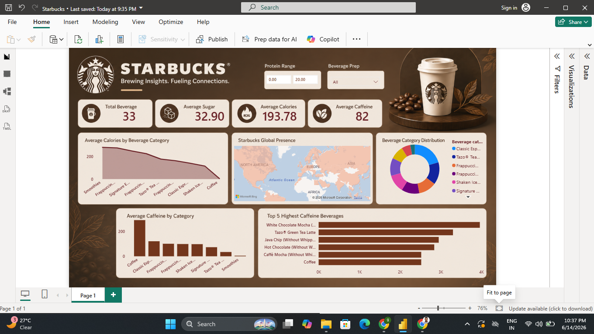
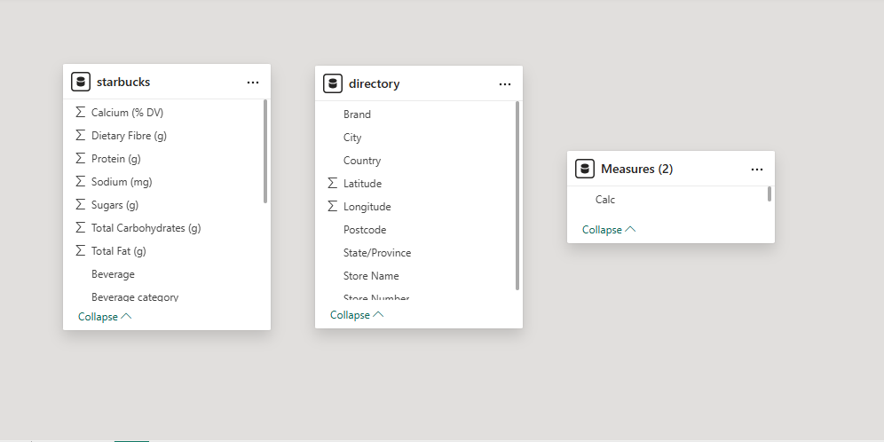

# ☕ Starbucks Beverage Analytics Dashboard

## Project Objective
Analyze Starbucks beverage nutritional data to identify patterns in calories, sugar, caffeine and beverage categories.

## Dashboard Overview

## Data Model

## Key KPIs

- Total Beverages: 33
- Average Calories: 193.78
- Average Sugar: 32.90
- Average Caffeine: 82

## Skills Used

- Power BI
- DAX
- Power Query
- Data Modeling
- Data Visualization

## Business Insights

- Smoothies have the highest calories.
- Coffee has the highest caffeine levels.
- Specialty drinks contribute heavily to sugar intake.

## Author

Girish Baviskar
